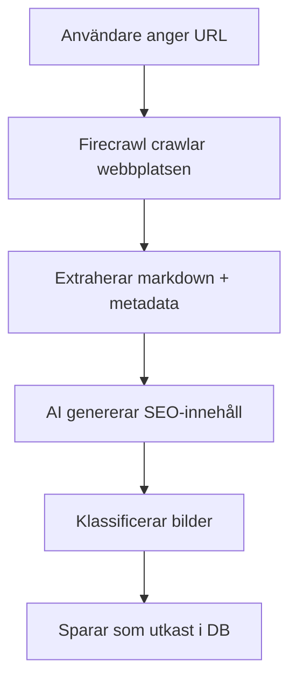

# Firecrawl Implementation för Arrangörssidor

## Översikt

Vi har ersatt den tidigare Cheerio-baserade web scraping-lösningen med **Firecrawl API** för att få mycket bättre kvalitet på data när vi importerar arrangörssidor.

## Fördelar med Firecrawl

✅ **Bättre content-kvalitet** - Renare markdown utan skräp  
✅ **Automatisk filtrering** - Tar automatiskt bort navigation, footer, och annat irrelevant innehåll  
✅ **Strukturerad metadata** - Hämtar Open Graph tags och annan metadata  
✅ **Enklare kod** - Mindre custom parsing behövs  
✅ **Gratis tier** - 500 requests/månad ingår

## Installation

Firecrawl SDK är redan installerat:

```bash
npm install @mendable/firecrawl-js
```

## Konfiguration

### Miljövariabel

Lägg till i `.env.local`:

```env
FIRECRAWL_API_KEY=your_api_key_here
```

Hämta din API-nyckel från: https://www.firecrawl.dev/

## Implementering

### Filer som uppdaterats

1. **`/src/lib/services/organizer-crawler.ts`**
   - Ersatt Cheerio med Firecrawl SDK
   - Använder `firecrawl.scrape()` med markdown och HTML-format
   - Extraherar data från ren markdown istället för HTML
   - Nya hjälpfunktioner för att parsa markdown

2. **`/src/lib/services/organizer-ai-generator.ts`**
   - Uppdaterad funktion-signatur för att acceptera markdown
   - Förbättrad prompt som utnyttjar ren markdown
   - Genererar nu även `title` och `content` (inte bara SEO-fält)
   - Ökade `max_tokens` till 1500 för längre innehåll

3. **`/src/app/api/organizer-pages/import/route.ts`**
   - Uppdaterad för nya funktions-signaturer
   - Firecrawl-specifik felhantering:
     - Rate limit (429)
     - API key fel (401)
     - Scraping-fel (422)

## Användning

### Importera från URL (Admin)

1. Gå till **Arrangörssidor** i admin-panelen
2. Klicka på **"Importera från URL"**
3. Ange URL till arrangörens webbplats
4. Vänta medan Firecrawl crawlar, AI genererar innehåll, och bilder klassificeras
5. Arrangörssidan skapas som utkast

### Hur det fungerar



### API-flöde

```typescript
// 1. Crawl med Firecrawl
const scrapeResult = await firecrawl.scrape(url, {
  formats: ['markdown', 'html'],
  onlyMainContent: true
})

// 2. Extrahera strukturerad data
const crawledData = {
  title: metadata?.title || extractTitleFromMarkdown(markdown),
  metaDescription: metadata?.description,
  content: markdown,  // Ren markdown, perfekt för AI
  markdown: markdown,
  images: [metadata?.ogImage, ...htmlImages],
  contactInfo: extractContactInfo(markdown),
  socialLinks: extractSocialLinks(html)
}

// 3. AI-genererar innehåll
const aiContent = await generateOrganizerContent(
  crawledData.title,
  crawledData.metaDescription,
  crawledData.content,
  crawledData.markdown,
  crawledData.contactInfo,
  crawledData.socialLinks
)

// 4. Klassificerar bilder
const imageClassification = await classifyImages(crawledData.images)

// 5. Spara till databas
await supabase.from('organizer_pages').insert({
  slug: aiContent.slug,
  name: crawledData.title,
  title: aiContent.title,
  description: aiContent.description,
  content: aiContent.content,  // AI-genererat markdown-innehåll
  hero_image_url: imageClassification.heroImage,
  gallery_images: imageClassification.galleryImages,
  contact_info: crawledData.contactInfo,
  social_links: crawledData.socialLinks,
  seo_title: aiContent.seo_title,
  seo_description: aiContent.seo_description,
  seo_keywords: aiContent.seo_keywords,
  is_published: false
})
```

## Felhantering

### Rate Limit (429)

**Problem:** För många requests till Firecrawl API  
**Lösning:** Vänta några minuter och försök igen  
**Gräns:** 500 requests/månad på free tier

```json
{
  "error": "Rate limit reached",
  "details": "Firecrawl API rate limit reached. Try again in a few minutes.",
  "type": "rate_limit"
}
```

### API Key Fel (401)

**Problem:** API-nyckel saknas eller är felaktig  
**Lösning:** Kontrollera att `FIRECRAWL_API_KEY` är korrekt i `.env.local`

```json
{
  "error": "API authentication failed",
  "details": "Firecrawl API key is missing or invalid.",
  "type": "auth_error"
}
```

### Scraping Fel (422)

**Problem:** Kunde inte extrahera innehåll från webbplatsen  
**Möjliga orsaker:**
- Webbplatsen blockerar scrapers
- Ovanlig webbplatsstruktur
- JavaScript-rendered innehåll som inte laddas

```json
{
  "error": "Failed to scrape website",
  "details": "Could not extract content from the website.",
  "type": "scrape_error"
}
```

## Skillnader från tidigare lösning

### Tidigare (Cheerio)

```typescript
// Manuell HTML-parsing
const $ = cheerio.load(html)
$('script, style, nav, header, footer').remove()
let content = $('main').text()
content = content
  .replace(/\s+/g, ' ')
  .replace(/\b(Boka|boka)\s+\w+/g, '')
  .replace(/\b\d{2,3}-\d{2,3}\s*\d{2,3}\b/g, '')
  // ... mycket mer rensning
```

**Problem:**
- Mycket manuell rensning krävdes
- Svårt att filtrera bort irrelevant innehåll
- Olika webbplatser krävde olika selektorer

### Nu (Firecrawl)

```typescript
// Automatisk rensning och markdown-konvertering
const scrapeResult = await firecrawl.scrape(url, {
  formats: ['markdown', 'html'],
  onlyMainContent: true  // Firecrawl gör allt automatiskt
})

const content = scrapeResult.markdown  // Ren, strukturerad markdown
```

**Fördelar:**
- Ingen manuell rensning behövs
- Konsekvent kvalitet över olika webbplatser
- Bättre strukturerad data för AI

## AI-förbättringar

### Tidigare prompt

```
INNEHÅLL: ${content.substring(0, 2000)}...

Generera:
1. BESKRIVNING (2-3 meningar)
2. SEO-TITEL (max 60 tecken)
3. SEO-BESKRIVNING (max 160 tecken)
4. NYCKELORD (3-5 st)
5. SLUG
```

### Ny prompt

```
# Webbplatsinnehåll (Markdown):
${markdown.substring(0, 3000)}...

Skapa följande i JSON-format:
{
  "title": "Kort, engagerande titel",
  "description": "Inspirerande beskrivning (2-3 meningar)",
  "content": "Längre innehåll i markdown (3-5 paragrafer)",
  "seo_title": "SEO-titel (max 60 tecken)",
  "seo_description": "SEO-beskrivning (max 160 tecken)",
  "seo_keywords": "5-7 nyckelord",
  "slug": "url-slug"
}
```

**Förbättringar:**
- Längre innehåll (3000 chars istället för 2000)
- AI genererar även `title` och `content`
- Bättre strukturerad markdown som input
- Mer detaljerade instruktioner

## Testning

### Testa importen

```bash
# I admin-panelen
1. Gå till /organizer-pages
2. Klicka "Importera från URL"
3. Testa med:
   - https://www.varbergsteater.se
   - https://arenvarberg.se
   - https://www.societeten.org
```

### Debug-loggar

Firecrawl-implementationen loggar detaljerad information:

```
🔍 Crawling URL with Firecrawl: https://example.com
✅ Successfully crawled with Firecrawl: Example Company
   - Content length: 2543 chars
   - Images found: 8
   - Contact info: {"email":"info@example.com","phone":"0340123456"}
   - Social links: {"facebook":"https://facebook.com/example"}

🤖 Generating AI content...
✅ AI content generated successfully
   - Title: Example Company - Kultur i Varberg
   - Description length: 156 chars
   - Content length: 847 chars
   - Slug: example-company
```

## Kostnader

### Firecrawl Free Tier

- **500 requests/månad gratis**
- Perfekt för att testa och för mindre användning
- Uppgradering tillgänglig om behov uppstår

### OpenAI Kostnader

- GPT-4o-mini: ~$0.15 per 1M tokens
- Per import: ~3000 tokens input + 1500 tokens output = ~$0.0007 per import
- 1000 importer ≈ $0.70

## Framtida förbättringar

- [ ] Batch-import av flera URLs samtidigt
- [ ] Schemalagd uppdatering av befintliga sidor
- [ ] Förbättrad bildklassificering med Firecrawl's bildanalys
- [ ] Cache för Firecrawl-resultat för att spara API-calls
- [ ] Webhook-integration för automatisk import

## Support

**Firecrawl Dokumentation:** https://docs.firecrawl.dev/  
**Firecrawl Dashboard:** https://www.firecrawl.dev/dashboard

**Problem?** Kontrollera:
1. ✅ API-nyckel är korrekt i `.env.local`
2. ✅ Firecrawl SDK är installerat: `npm list @mendable/firecrawl-js`
3. ✅ Rate limits inte överskridit (500/månad)
4. ✅ URL är tillgänglig och inte blockerar scrapers

